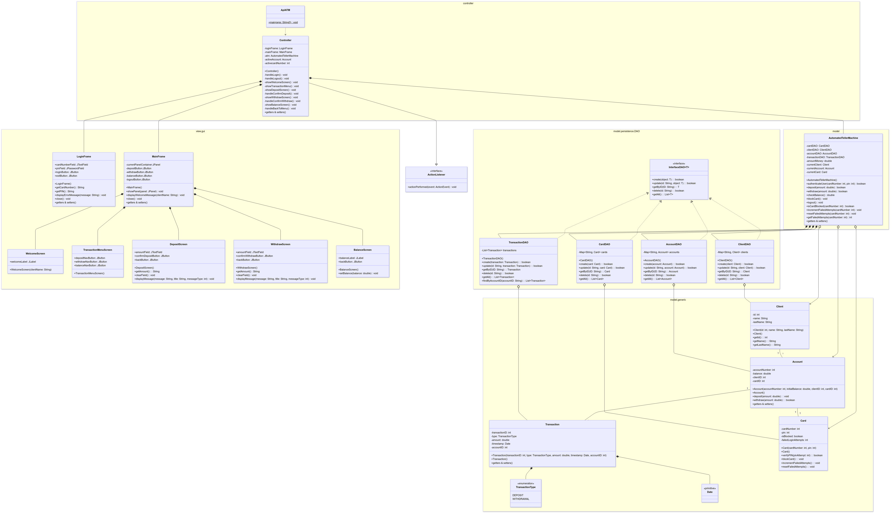

# ATM Software System

A comprehensive Automated Teller Machine (ATM) application developed in Java following the MVC architecture pattern, Factory Method for transactions, and SOLID principles.

## Table of Contents

- [Overview](#overview)
- [Features](#features)
- [Architecture](#architecture)
- [Class Diagram](#class-diagram)
- [Other Diagrams](#other-diagrams)
- [Getting Started](#getting-started)
- [Usage](#usage)
- [Testing](#testing)
- [Security Features](#security-features)
- [Project Structure](#project-structure)
- [Dependencies](#dependencies)
- [License](#license)

## Overview

This ATM software system simulates a real-world ATM, allowing users to perform banking operations such as cash withdrawal, cash deposit, and balance checking. The system is designed with security in mind, implementing features like user authentication, transaction validation, and card security.

## Features

### Key Functional Features
- **User Authentication**:
  - Identity verification via card number and PIN
  - PIN must be at least 4 digits
  - Lockout after 3 failed password attempts

- **Main Operations**:
  - Cash withdrawal (with configurable daily limit)
  - Cash deposit
  - Balance check
  - Extendable for future operations

- **Security**:
  - Identity validation before each operation
  - Configurable daily withdrawal limit per card
  - Permanent card lock after 3 failed attempts

### Additional Logical Features
- Validation of sufficient balance before allowing withdrawals
- Immediate balance update after each transaction
- Detailed logging of all transactions (date, time, type, amount)
- Validation of the available daily limit before each withdrawal
- Reset of the daily amount used upon date change
- Verification of available bills at the ATM before authorizing withdrawals
- Appropriate exception handling for common errors

## Architecture

The application follows the Model-View-Controller (MVC) architecture pattern:

- **Model**: Represents the data and business logic of the application
  - Core classes: `AutomatedTellerMachine`, `Account`, `Card`, `Client`, `Transaction`
  - Data Access Objects (DAOs): `AccountDAO`, `CardDAO`, `ClientDAO`, `TransactionDAO`

- **View**: Represents the user interface
  - GUI components: `LoginFrame`, `MainFrame`, `WelcomeScreen`, `TransactionMenuScreen`, etc.

- **Controller**: Acts as an intermediary between Model and View
  - Main controller: `Controller`
  - Application entry point: `AplATM`

## Class Diagram

The following class diagram illustrates the structure of the ATM system:



## Other Diagrams

The project includes several other UML diagrams to help understand different aspects of the system:

- **Use Case Diagram**: Located in `Files/CaseUseDiagram/`
- **Sequence Diagram**: Located in `Files/SequenceDiagram/`
- **Activity Diagram**: Located in `Files/ActivitiesDiagram/`
- **State Diagrams**: Located in `Files/StateDiagrams/`
- **Component Diagram**: Located in `Files/ComponentDiagram/`
- **Implementation Diagram**: Located in `Files/ImplementationDiagram/`
- **Collaboration Diagram**: Located in `Files/ColaborationDiagram/`

## Getting Started

### Prerequisites

- Java 13 or higher
- Maven 3.6 or higher

### Installation

1. Clone the repository:
   ```
   git clone https://github.com/yourusername/ATMSoftware.git
   ```

2. Navigate to the project directory:
   ```
   cd ATMSoftware
   ```

3. Build the project:
   ```
   mvn clean install
   ```

## Usage

### Running the Application

Run the application using Maven:
```
mvn exec:java -Dexec.mainClass="atmSoftware.controller.AplATM"
```

Or run the compiled JAR file:
```
java -jar target/ATMSoftware-1.0-SNAPSHOT.jar
```

### Login Credentials

The system is initialized with test accounts. The card numbers and PINs are printed to the console when the application starts. You can use these credentials to log in and test the system.

For detailed usage instructions, refer to the [User Manual](Files/UserManual.md).

## Testing

The project includes unit tests for the core functionality. Run the tests using Maven:
```
mvn test
```

## Security Features

- **Authentication**: Card number and PIN verification
- **Card Security**: Card blocking after 3 failed login attempts
- **Transaction Security**: Validation of sufficient funds and ATM cash availability
- **Session Management**: Automatic logout functionality

## Project Structure

```
ATMSoftware/
├── src/
│   ├── main/
│   │   ├── java/
│   │   │   └── atmSoftware/
│   │   │       ├── controller/
│   │   │       │   ├── AplATM.java
│   │   │       │   └── Controller.java
│   │   │       ├── model/
│   │   │       │   ├── generic/
│   │   │       │   │   ├── Account.java
│   │   │       │   │   ├── Card.java
│   │   │       │   │   ├── Client.java
│   │   │       │   │   ├── Transaction.java
│   │   │       │   │   └── TransactionType.java
│   │   │       │   ├── persistence/
│   │   │       │   │   └── DAO/
│   │   │       │   │       ├── AccountDAO.java
│   │   │       │   │       ├── CardDAO.java
│   │   │       │   │       ├── ClientDAO.java
│   │   │       │   │       ├── InterfaceDAO.java
│   │   │       │   │       └── TransactionDAO.java
│   │   │       │   ├── AutomatedTellerMachine.java
│   │   │       │   └── DataInitializer.java
│   │   │       └── view/
│   │   │           └── gui/
│   │   │               ├── BalanceScreen.java
│   │   │               ├── DepositScreen.java
│   │   │               ├── LoginFrame.java
│   │   │               ├── MainFrame.java
│   │   │               ├── TransactionMenuScreen.java
│   │   │               ├── WelcomeScreen.java
│   │   │               └── WithdrawScreen.java
│   │   └── resources/
│   └── test/
│       └── java/
│           └── atmSoftware/
│               └── model/
│                   └── AutomatedTellerMachineTest.java
├── Files/
│   ├── ActivitiesDiagram/
│   ├── CaseUseDiagram/
│   ├── ClassDiagram/
│   ├── ColaborationDiagram/
│   ├── ComponentDiagram/
│   ├── ImplementationDiagram/
│   ├── SequenceDiagram/
│   ├── StateDiagrams/
│   └── UserManual.md
├── pom.xml
└── README.md
```

## Dependencies

- JUnit 5.8.2 - For unit testing

## License

This project is licensed under the MIT License - see the LICENSE file for details.

## Acknowledgments

- This project was developed as part of a software engineering course
- Special thanks to all contributors and reviewers
